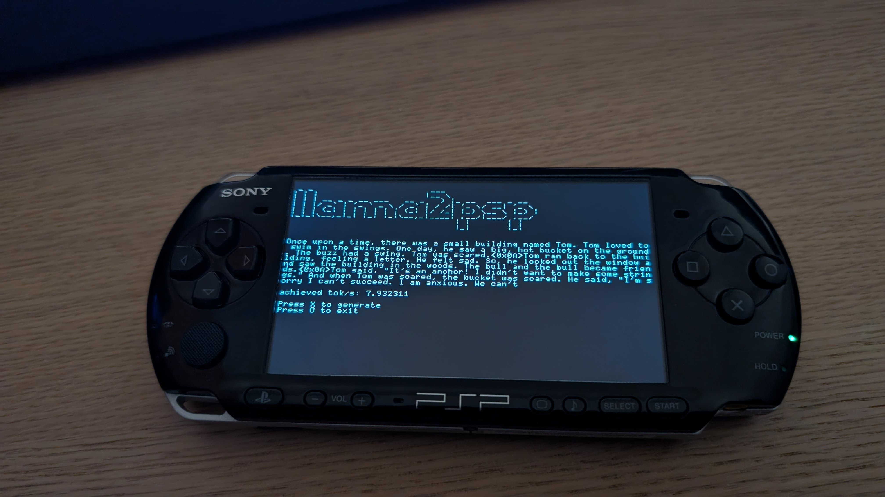

## llama2psp

A quick homebrew for running [llama2.c](https://github.com/karpathy/llama2.c) on the PSP.



## Prerequisites
*Taken from [hello-world-psp](https://github.com/filfreire/hello-world-psp)*

Setup `pspdev` toolchain, [see docs](https://psp-dev.org/doku.php?id=tutorial:toolchain_setup).

You can use [Docker image](https://github.com/filfreire/pspdev-docker) of [pspdev](https://github.com/pspdev/pspdev). There's helper script that uses aliases this container in this repo:

```shell
sudo cp pspdev-docker /usr/local/bin
```

## How to build
- Clone this repo and `cd` into the repo folder.
- If you used the `docker` alternative, run:

```shell
psp-docker make
```

## Installation
- Put the `EBOOT.PBP` in the following directory `PSP/GAME/llama2psp/EBOOT.PBP` as well as the model named `model.bin` and tokenizer named `tok.bin`
- Models and tokenizer have to be in the llama2.c format and can be downloaded [here](https://huggingface.co/karpathy/tinyllamas/tree/main)

- Due to the hardware limitations of the PSP, I used the smallest 260k model and its tokenizer.
